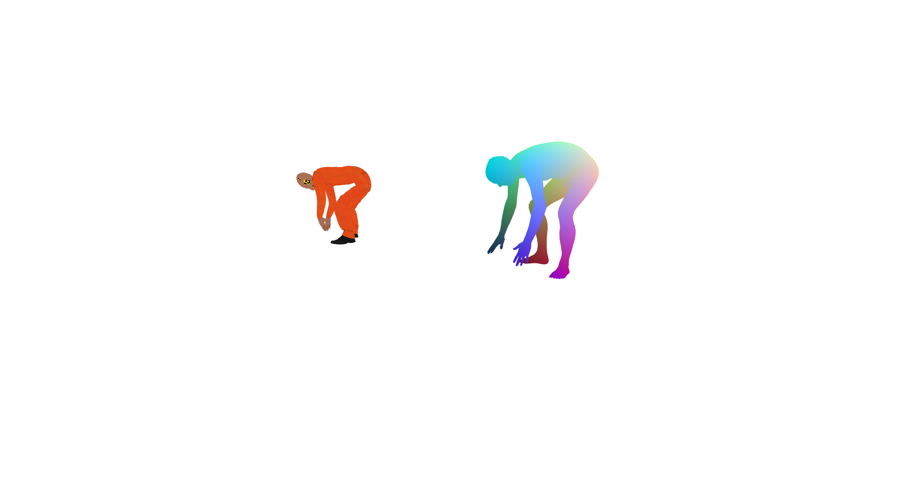
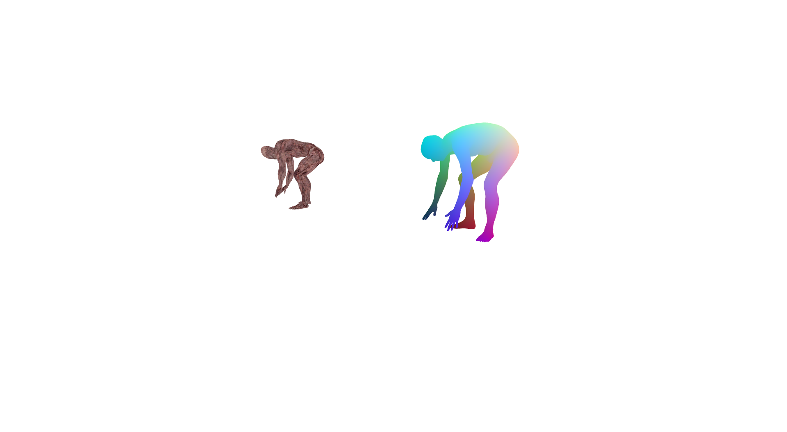
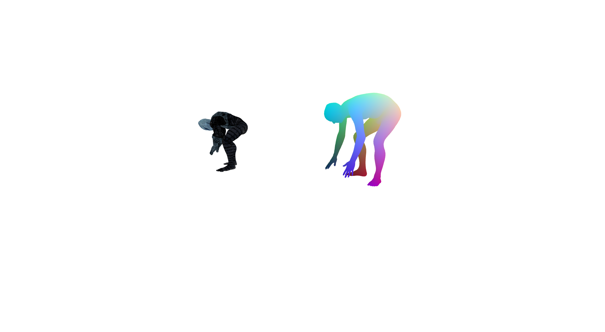
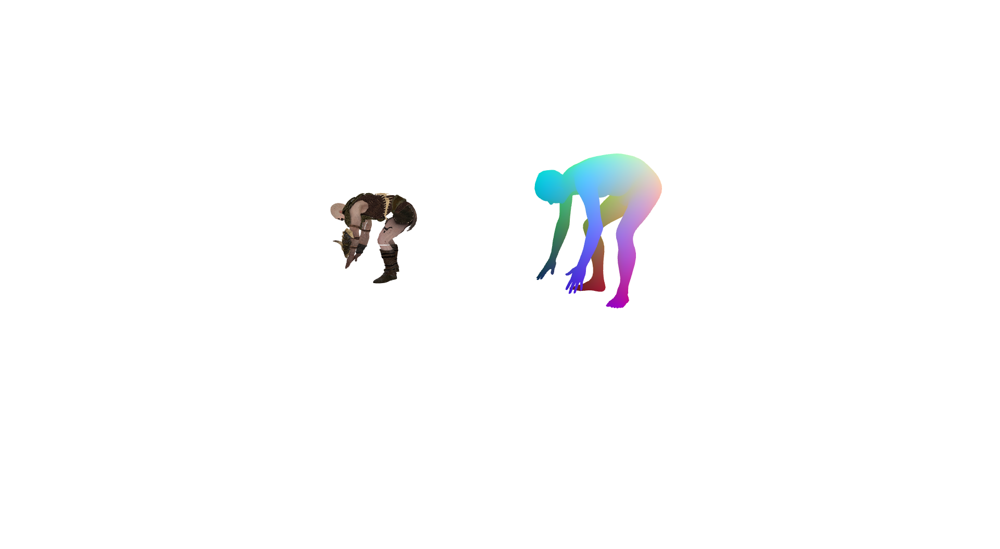
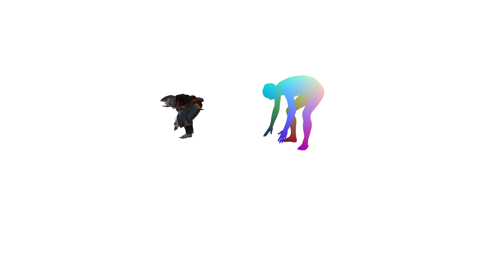

# Pose2Carton 

EE228 课程大作业，利用3D骨架控制3D卡通人物。

# Maya 环境配置

在Maya官网(https://www.autodesk.com/products/maya/overview?term=1-YEAR)
中下载Maya2020并进行安装，有30天的试用期

# 匹配流程

1)	从3D模型网站中下载模型，要求模型为T-posed。
2)	在终端中运行mayapy fbx_parser.py xxx.fbx，得到.txt，.obj和fbm文件夹。
3)	在手动匹配关节点后，运行transfer.py，设置use_online_model=True，生成obj序列。
4)	将mtl文件中的绝对路径更改为相对路径，并将fbm文件夹下的图片放在生成的序列中进行贴图。
5)	运行vis.py, 设置use_online_model=True，生成mp4文件

# 项目结果

# 协议 
本项目在 Apache-2.0 协议下开源

所涉及代码及数据的最终解释权归倪冰冰老师课题组所有

Group 27
